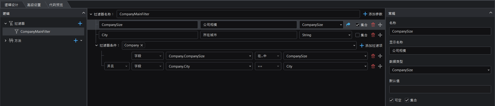
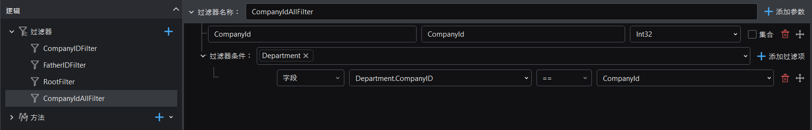
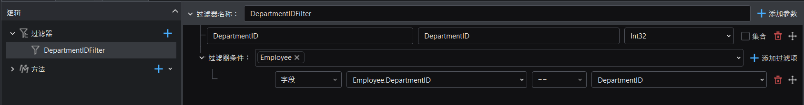
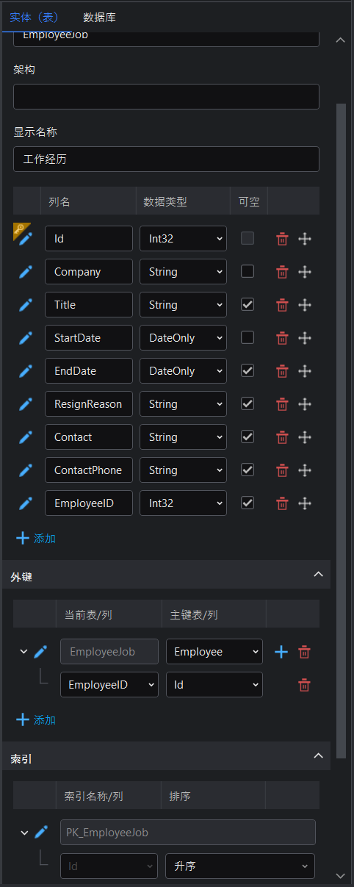
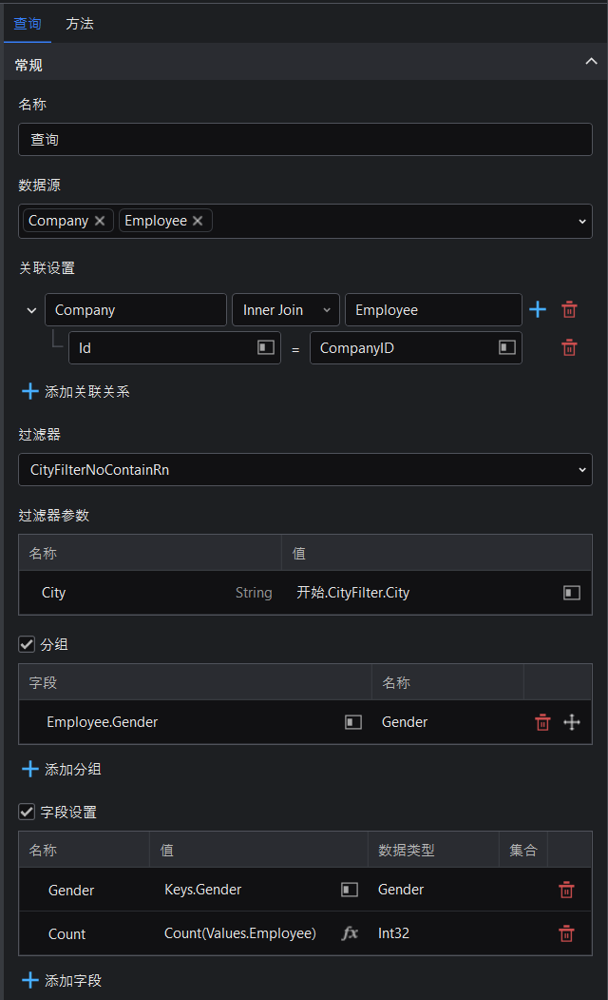
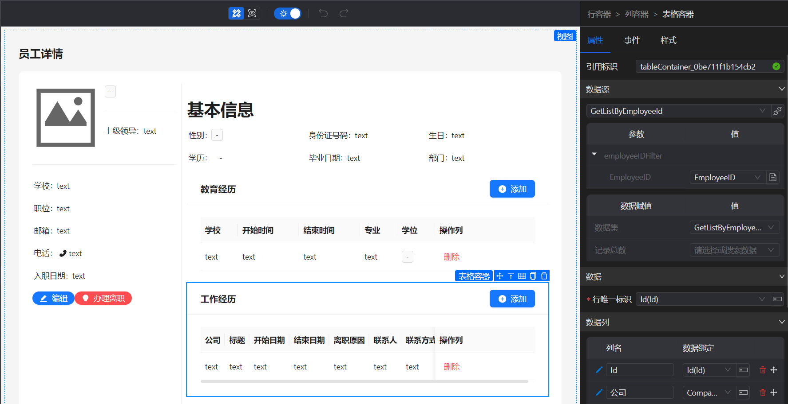

# 项目设计文档：创建企业员工统计系统

## 设计思路

### 项目类型

此应用示例的设计项目类型是 **浏览器端 Web 和 API**，以便同时生成前端 Web 应用程序及后端 Web API 服务。

### 实体（表）

应用示例包含一个实体文件，该实体文件包含的表如下：

- Employee：员工信息
- Company：公司信息
- CompanyContact：公司联系人信息
- EmployeeJob：员工工作经历
- Education：员工教育经历
- Department：部门信息

          

### 逻辑

应用示例包含了以下逻辑设计文件：

- Company.sdlg：配置跟公司相关的过滤器及增删改查方法。
- CompanyContact.sdlg：配置跟公司联系人相关的过滤器及增删查方法。
- Department.sdlg：配置跟部门相关的过滤器及增改查方法。
- Education.sdlg：配置跟员工教育经历相关的过滤器及增删查方法。
- Employee.sdlg：配置跟员工相关的过滤器及增删改查方法。
- EmployeeJob.sdlg：配置跟员工工作经历相关的过滤器及增删查方法。
- StatisticsService.sdlg：配置跟统计数据相关的过滤器及查询方法。

### 枚举

应用示例包含以下枚举：

- CompanySize：表示公司规模（如大型、中型、小型、微型等）。Company表的 **CompanySize** 字段为 **CompanySize** 枚举类型。
- DegreeType：表示员工学历（如学士、硕士、博士、教授等）。Education和Employee表的 **Degree** 字段为 **DegreeType** 枚举类型。
- EmployeeStatus：表示员工状态（如实习、试用期、全职、离职等）。Employee表的 **Status** 字段为 **EmployeeStatus** 枚举类型。
- Gender：表示员工性别。Employee表的 **Gender** 字段为 **Gender** 枚举类型。
- PositionType：表示员工职位（如人事、管理、董事等）。CompanyContact表的 **ContactPostion** 字段为 **PositionType** 枚举类型。


### 模型

对于每个实体表会自动生成一个同名的模型，例如：Compay、CompanyContact、Department、Education、Employee、EmployeeJob。

系统还提供了部分内置模型，例如：LoginModel、LoginResult、OperationResult、PageParameter、PageResult、RegisterModel。

此应用示例还包含以下自定义模型：

- CityDTO：用于表示公司所在城市名称。Company.sdlg逻辑的GetCompanyCityList查询方法返回值为 **CityDTO** 模型。
- CompanySizeStaticDTO：用于表示所有规模的公司统计数据。Company.sdlg逻辑的CountCompanySizeByFilter查询方法返回值为 **CompanySizeStaticDTO** 模型。 
- ResignDTO：用于表示员工离职信息（如原因、日期）。Employee.sdlg逻辑的Resign方法参数ResignDTO数据类型设置为 **ResignDTO** 模型。
- StatisticCompanySizeDTO：用于表示某个规模的公司统计数据。StatisticsService.sdlg逻辑的StatisticCompanySize查询方法返回值为 **StatisticCompanySizeDTO** 模型。
- StatisticEmployeeDegree：用于表示某种学历的员工统计数据。StatisticsService.sdlg逻辑的StatisticDegreeByCompany查询方法返回值为 **StatisticEmployeeDegree** 模型。
- StatisticEmployeeStatusDTO：用于表示某种状态（如试用期、离职等）的员工统计数据。StatisticsService.sdlg逻辑的StatisticEmployeeStatus查询方法返回值为 **StatisticEmployeeStatusDTO** 模型。
- StatisticEmployeeWorkYearDTO：用于表示某个工作年限的员工统计数据。StatisticsService.sdlg逻辑的StatisticEmployeeWorkYear查询方法返回值为 **StatisticEmployeeWorkYearDTO** 模型。
- StatisticGenderDTO：用于表示男员工和女员工的统计数据。StatisticsService.sdlg逻辑的StatisticEmployeeGender查询方法返回值为 **StatisticGenderDTO** 模型。


### 视图

#### Layout（布局）

布局页面设计了三个子菜单，分别对应如下页面：

1. 首页 -- 关联 Home 视图，主要用于统计图表展示。
2. 公司管理 – 关联 CompanyList 视图，主要用于公司列表展示及公司增加、删除、更新、详情。
3. 员工管理 -- 关联 Employee_Department_TreeList 视图，主要用于员工列表展示及员工增加、删除、详情。


运行效果如下：


#### Home（首页）

首页使用图表组件展示查询模型接口数据。其中包含以下过滤条件：

1、城市（下拉框）

2、是否包含-离职人员（开关）

3、公司（下拉框）

以上作用于所选接口过滤参数，返回相应过滤数据。

Home 页面运行效果如下：


#### 公司相关视图

公司页面相关视图如下：

- CompanyAdd：新增公司视图。
- ContactAdd：新增公司联系人视图。
- CompanyDetail：公司详情视图。
- CompanyList：公司列表视图。
- CompanyUpdate：更新公司信息视图。

视图引用及参数传递：

- 当点击布局页面（Layout）中的“公司管理”菜单时，打开CompanyList视图。上方卡片的数据源为Company.CountCompanySizeByFilter接口，下方的表格容器的数据源为Company.GetPageBySizeAndCity接口。
- 当点击CompanyList视图中的“添加公司”按钮时，以对话框形式打开CompanyAdd视图。
- 当点击CompanyDetail视图中的“添加联系人”按钮时，以对话框形式打开ContactAdd视图。
- 当点击CompanyList视图中的“详情”按钮时，以抽屉形式打开CompanyDetail视图，并将当前所选行的公司id以页面参数形式传递给CompanyDetail页面，CompanyDetail页面中接收页面参数，并将其作为访问Get接口的参数，获取公司详情。
- 当点击CompanyList视图中的“编辑”按钮时，以对话框形式打开CompanyUpdate视图，并将当前所选行的公司id以页面参数形式传递给CompanyUpdate页面，CompanyUpdate页面接收页面参数，并将其作为访问Get接口的参数，获取公司详情，对应字段到表单可修改，编辑完成后通过Update接口更新数据。

#### 部门相关视图

部门页面相关视图如下：

- Employee_Department_TreeList：树形展示所有部门（根据所选公司过滤）及当前部门的员工。表格字段对员工性别、学历、员工状态的枚举数据做显示控制。
- DepartmentAdd：新增部门视图。
- DepartmentEdit：更新部门信息视图。

视图引用及参数传递：

- 当点击布局页面（Layout）中的“员工管理”菜单时，打开Employee_Department_TreeList视图，左边单选框组展示公司列表，数据源为Company.GetCompanyList接口，树形控件展示部门列表，数据源为Department.GetDepartmentListByCompanyID接口（**参数**CampanyID绑定其旁边的公司列表单选框组所选数据，**选项名称**为显示的树节点名称，**选项值**为该节点绑定值，**选项子项**为子节点的绑定字段），右边表格容器展示当前部门的所有员工，数据源为Employee.GetPageByDepartment接口（根据树形控件中所选部门的ID筛选出该部门员工）。
- 当点击Employee_Department_TreeList视图中的“添加部门”按钮时，以对话框形式打开DepartmentAdd视图，并传递单选框组中所选公司的ID，作为DepartmentAdd视图中所属公司的默认值。
- 当点击Employee_Department_TreeList视图中的“编辑部门”按钮时，以对话框形式打开DepartmentEdit视图，并传递树形控件中选中部门的ID。
- 当点击Employee_Department_TreeList视图中的“添加员工”按钮时，打开EmployeeAdd视图，并传递两个参数companyid和departmentid，作为EmployeeAdd视图中的所属公司和所属部门的默认值。Employee的各个字段绑定到各个表单项，分别使用合适的组件。

#### 员工相关视图

员工页面相关视图如下：

- EducationAdd：新增员工教育经历视图。
- EmployeeAdd：新增员工视图。
- EmployeeDetail：员工详情视图。
- EmployeeResign：办理员工离职视图，编辑员工状态为离职。
- EmployeeUpdate：编辑员工信息视图。
- EmployeeJobAdd：新增员工工作经历视图。

视图引用及参数传递：

- 当点击Employee_Department_TreeList视图中的“详情”按钮时，打开EmployeeDetail视图，并传递当前员工的ID。布局左和上展示员工的基本信息，绑定卡片数据集。教育经历表格容器数据源为Education.GetListByEmployeeID接口，并使用视图参数employeeid过滤获取属于该员工的教育经历，工作经历表格容器数据源为EmployeeJob.GetListByEmployeeID接口，并使用视图参数employeeid过滤获取属于该员工的工作经历。
- 当点击EmployeeDetail视图中的教育经历表格的“添加”按钮时，以对话框形式打开EducationAdd视图。
- 当点击EmployeeDetail视图中的工作经历表格的“添加”按钮时，以对话框形式打开EmployeeJobAdd视图。
- 当点击EmployeeDetail视图中的“编辑”按钮时，以对话框形式打开EmployeeUpdate视图，并以视图参数形式传递当前员工的ID。
- 当点击EmployeeDetail视图中的“办理离职”按钮时，以对话框形式打开EmployeeResign视图，并以视图参数形式传递当前员工的ID。

### 自定义数据

项目自定义代码中插入几条数据，便于第一次运行项目能看到图表效果。


## 开发流程

以下是开发演示应用程序的详细分步指南。

### 创建设计器项目

在 SnapDevelop 中，选择 **文件** > **新建** > **新建项目** > **浏览器端 Web 和 API**。

如果您已经下载了演示应用程序，则可以直接在 SnapDevelop 中打开它。

### 创建实体和逻辑

右键单击项目并选择 **添加** > **新建项** > **实体设计（从零开始）** 添加一个空白实体文件，假设命名为 database.sde，然后在实体文件中添加以下表：

- **Company** 表包含以下字段：Id、CompanyName、Logo、CompanySize、Province、City。
- **CompanyContact** 表包含以下字段：Id、CompanyID、EmployeeID、ContactPosition。
- **Department** 表包含以下字段：Id、DepartmentName、FatherID、CompanyID。
- **Education** 表包含以下字段：Id、School、StartDate、EndDate、Major、Degree、EmployeeID。
- **Employee** 表包含以下字段：Id、Name、Gender、Email、Phone、Avatar、HireDate、ResignDate、Degree、EducateSchool、EducateDate、DepartmentID、LeaderID、Status、CompanyID、ResignReason、BirthDay。
- **EmployeeJob** 表包含以下字段：Id、Company、Title、StartDate、EndDate、ResignReason、Contact、ContactPhone、EmployeeID。

详细设置将在以下小节中进行解释。 如果您已下载演示应用程序，则可以打开 **Database.sde** 文件来查看设置。

#### Company 表

下面介绍设计 **Company** 表的关键步骤：

步骤 1：将 **Id** 字段设置为 **主键**。

步骤 2：将 **Province** 和 **City** 字段设置为 **可空**。

步骤 3：将 **Logo** 字段设置为 **集合** 和 **可空**。


步骤 4：将 **CompanySize** 的字段类型设置为 **CompanySize** 枚举类型。

如果下拉列表中不存在 **CompanySize** 枚举，你可以在下拉列表中点击 **+添加**。在打开的 **自定义数据结构** 窗口中，添加 **CompanySize** 枚举类型如下：


#### Company 逻辑

首先添加一个逻辑设计文件（右键单击项目并选择 **添加** > **新建项** > **逻辑设计（API）** ），假设命名为 Company.sdlg。这个文件用来设计跟 Company 表相关的逻辑，比如过滤器、增删改查方法等。

##### 过滤器

在 Company.sdlg 逻辑设计文件中添加一个名为 **CompanyMainFilter** 的过滤器，设置如下：

这个过滤器将在创建方法时用到。



##### 方法

在 Company.sdlg 逻辑设计文件中添加增删改查方法：

选择 **Company** 表为数据源，选中 **新增**、**删除**、**更新**、**查询单条数据**，点击 **添加**。

把 Add、Delete、Update、Get 方法名分别改为 AddCompany、DeleteCompany、UpdateCompany、GetCompany。


用上图同样方法，选择 **查询单条数据**，点击 **添加**。将方法名字改为 GetCompanyDetail。

用上图同样方法，选择 **查询单条数据**，点击 **添加**。将方法名字改为 GetCompanyList。

用上图同样方法，选择 **查询分页数据**（并选中 **CompanyMainFilter** 过滤器），点击 **添加**。将方法名字改为 GetPageBySizeAndCity。

用上图同样方法，选择 **查询多条数据**，点击 **添加**。将方法名字改为 **GetCompanyCityList**。在 **GetCompanyCityList** 的 **方法** 选项卡页面，设置 **返回值** 为 **CityDTO** 模型。

如果 **返回值** 下拉列表中不存在 **CityDTO** 模型，你可以在下拉列表中点击 **+添加**。在打开的 **自定义数据结构** 窗口中，添加 **CityDTO** 模型如下：


选中 **集合**，设置 CityDTO 字段值为 **查询.QueryModel**，CityName 字段值为 **查询.QueryModel.City**。


用上述同样方法，选择 **查询多条数据**，点击 **添加**。将方法名字改为 **CountCompanySizeByFilter**。在 **CountCompanySizeByFilter** 的 **方法** 选项卡页面，设置 **返回值** 为 **CompanySizeStaticDTO** 模型。

如果 **返回值** 下拉列表中不存在 **CompanySizeStaticDTO** 模型，你可以在下拉列表中点击 **+添加**。在打开的 **自定义数据结构** 窗口中，添加 **CompanySizeStaticDTO** 模型如下：


设置模型字段值为如下表达式。

```
Countlf(查询.Company.ld,查询.Company.CompanySize == CompanySize.Tiny)
Countlf(查询.Company.ld,查询.Company.CompanySize == CompanySize.Small)
Countlf(查询.Company.ld,查询.Company.CompanySize == CompanySize.Big)
Countlf(查询.Company.ld,查询.Company.CompanySize == CompanySize.Large)
Count(查询.Company.ld)
```


#### CompanyContact 表

下面介绍设计 **CompanyContact** 表的关键步骤：

步骤 1：将 **Id** 字段设置为 **主键**。

步骤 2：创建以下外键映射关系：

- EmployeeID 引用 Employee 表的 Id 字段。
- CompanyID 引用 Company 表的 Id 字段。


步骤 3：设置 **ContactPostion** 字段为 **PositionType** 枚举类型，**可空**。

如果下拉列表中不存在 **PositionType** 枚举，你可以在 **自定义数据结构** 窗口中，添加 **PositionType** 枚举类型如下：


#### CompanyContact 逻辑

添加一个逻辑设计文件（右键单击项目并选择 **添加** > **新建项** > **逻辑设计（API）** ），假设命名为 CompanyContact.sdlg。这个文件用来设计跟 CompanyContact 表相关的逻辑，比如过滤器、增删改查方法等。

##### 过滤器

在 CompanyContact.sdlg 逻辑设计文件中添加一个名为 **CompanyIdFilter** 的过滤器。这个过滤器将在创建方法时用到。


##### 方法

在 CompanyContact.sdlg 逻辑设计文件中添加增删查方法：

选择 **CompanyContact** 表为数据源，选中 **新增**、**删除**、**查询多条数据**（并选中 **CompanyIdFilter** 过滤器），点击 **添加**。


将Add、Delete、GetList 方法名字分别改为：AddContact、DeleteContact、GetListByCompanyId。

选中 GetListByCompanyId 的 **查询** 过程（在中间设计视窗中选择 **查询** 组件），在右边 **查询** 选项卡中选中  **Employee** 关联查询。


#### Department 表

下面介绍设计 **Department** 表的关键步骤：

步骤 1：将 **Id** 字段设置为 **主键**。

步骤 2：配置 **FatherID** 字段为 **可空**。

步骤 3：创建以下外键映射关系：

- FatherID 引用 Department 表的 Id 字段。
- CompanyID 引用 Company 表的 Id 字段。


#### Department 逻辑

添加一个逻辑设计文件（右键单击项目并选择 **添加** > **新建项** > **逻辑设计（API）** ），假设命名为 Department.sdlg。这个文件用来设计跟 Department 表相关的逻辑，比如过滤器、增删改查方法等。

##### 过滤器

在 Department.sdlg 逻辑设计文件中添加名为 **CompanyIDFilter**、**FatherIDFilter**、**RootFilter**、**CompanyIdAllFilter** 的过滤器。这些过滤器将在创建方法时用到。




##### 方法

在 Department.sdlg 逻辑设计文件中添加增改查方法：

选择 **Department** 表为数据源，选中 **新增**、**更新**，点击 **添加**。


将Add和Update方法名改为AddDepartment和UpdateDepartment。

重复以上步骤：选中 **查询单条数据**，点击 **添加**。将方法改为GetDepartmentById。

重复以上步骤：选中 **查询多条数据**，选择 **CompanyIdAllFilter** 过滤器，点击 **添加**。将方法名改为GetDepartmentAllListByCompanyID。

重复以上步骤：选中 **查询多条数据**，选择 **RootFilter** 过滤器，点击 **添加**。将方法名改为GetRootDepartmentList。

重复以上步骤：选中 **查询多条数据**，选择 **CompanyIdFilter** 过滤器，点击 **添加**。将方法名改为GetDepartmentListByCompanyID。选中 GetDepartmentListByCompanyID 的 **查询** 过程（在中间设计视窗中选择 **查询** 组件），在 **查询** 选项卡中选中  **Departments** 关联查询。


#### Education 表

下面介绍设计 **Education** 表的关键步骤。

步骤 1：将 **Id** 字段设置为 **主键**。

步骤 2：将 **School**、**StartDate** 、**EndDate**、**Major**、**Degree**、**EmployeeID** 设置为 **可空**。

步骤 3：创建以下外键映射关系：

- EmployeeID 引用 Employee 表的 Id 字段。


步骤 3：将 **Degree** 字段类型设置为 **DegreeType** 枚举类型。

如果下拉列表中不存在 **DegreeType** 枚举，你可以在 **自定义数据结构** 窗口中，添加 **DegreeType** 枚举类型如下：


#### Education 逻辑

添加一个逻辑设计文件，假设命名为 Education.sdlg。这个文件用来设计跟 Education 表相关的逻辑，比如过滤器、增删改查方法等。

##### 过滤器

在 Education.sdlg 逻辑设计文件中添加名一个名为 **EmployeeIdFilter** 的过滤器。这个过滤器将在创建方法时用到。


##### 方法

在 Education.sdlg 逻辑设计文件中添加增删查方法：

选择 **Education** 表为数据源，选中 **新增**、**删除**、**查询多条数据**（并选中 **EmployeeIdFilter** 过滤器），点击 **添加**。


将Add、Delete、GetList 方法名字分别改为：AddEducation、DeleteEducation、GetListByEmployeeId。

#### Employee 表

下面介绍设计 **Employee** 表的关键步骤。

步骤 1：将 **Id** 字段设置为 **主键**。

步骤 2：将 **Avatar** 字段设置为 **集合** 和 **可空**。

步骤 3：将 **Email**、**Phone**、**ResignDate**、**Degree**、**EducateSchool**、**EducateDate**、**LeaderID**、**CompanyID**、**ResignReason**、**BirthDay**、**IdCard**、**Position** 字段设置为 **可空**。

步骤 4：创建以下外键映射关系：

- LeaderID 引用 Employee 表的 Id 字段。
- CompanyID 引用 Company 表的 Id 字段。
- DepartmentID 引用 Department 表的 Id 字段。


步骤 5：将 **Gender** 的字段类型设置为 **Gender** 枚举类型。

如果下拉列表中不存在 **Gender** 枚举，你可以在 **自定义数据结构** 窗口中，添加 **Gender** 枚举类型如下：


步骤 6：将 **Degree** 字段类型设置为 **DegreeType** 枚举类型。

步骤 7：将 **Status** 字段类型设置为 **EmployeeStatus** 枚举类型。

如果下拉列表中不存在 **EmployeeStatus** 枚举，你可以在 **自定义数据结构** 窗口中，添加 **EmployeeStatus** 枚举类型如下：


#### Employee 逻辑

添加一个逻辑设计文件，假设命名为 Employee.sdlg。这个文件用来设计跟 Employee 表相关的逻辑，比如过滤器、增删改查方法等。

##### 过滤器

在 Employee.sdlg 逻辑设计文件中添加一个名为 **DepartmentIDFilter** 的过滤器。这个过滤器将在创建方法时用到。



##### 方法

在 Employee.sdlg 逻辑设计文件中添加增删查方法：

选择 **Employee** 表为数据源，选中 **新增**、**删除**、**更新**、**查询单条数据**、**查询多条数据**、**查询分页数据**（并选中 **DepartmentIDFilter** 过滤器），点击 **添加**。

把 Add、Delete、Update、Get、GetList 、GetPage 方法名分别改为 AddEmployee、DeleteEmployee、UpdateEmployee、GetEmployee、GetEmployeeList、GetPageByDepartment。


重复上述步骤，选择 **查询单条数据**，点击 **添加**。将方法名改为 GetEmployeeDetail。选中 GetEmployeeDetail 的 **查询** 过程（在中间设计视窗中选择 **查询** 组件），在 **查询** 选项卡中选中  **EmployeeNavigation** 和 **Department** 关联查询。


重复上述步骤，选择 **更新**，点击 **添加**。将方法名改为 Resign。在 **方法** 选项卡中，设置参数数据类型为 **ResignDTO** 模型。

如果 **返回值** 下拉列表中不存在 **ResignDTO** 模型，你可以在 **自定义数据结构** 窗口中，添加 **ResignDTO** 模型如下：


#### EmployeeJob 表

下面介绍设计 **EmployeeJob** 表的关键步骤。

步骤 1：将 **Id** 字段设置为 **主键**。

步骤 3：将 **Title**、**EndDate**、**ResignReason**、**Contact**、**ContactPhone**、**EmployeeID** 字段设置为 **可空**。

步骤 4：创建以下外键映射关系：

- EmployeeID 引用 Employee 表的 Id 字段。



#### EmployeeJob 逻辑

添加一个逻辑设计文件，假设命名为 EmployeeJob.sdlg。这个文件用来设计跟 EmployeeJob 表相关的逻辑，比如过滤器、增删改查方法等。

##### 过滤器

在 EmployeeJob.sdlg 逻辑设计文件中添加一个名为 **EmployeeIDFilter** 的过滤器。这个过滤器将在创建方法时用到。


##### 方法

在 EmployeeJob.sdlg 逻辑设计文件中添加增删查方法：

选择 **EmployeeJob** 表为数据源，选中 **新增**、**删除**、**查询多条数据**（并选中 **EmployeeIDFilter** 过滤器），点击 **添加**。

将Add、Delete、GetList 方法名字分别改为：AddEmployeeJob、DeleteEmployeeJob、GetListByEmployeeId。


#### StatisticsService逻辑

添加一个逻辑设计文件，假设命名为 StatisticsService.sdlg。这个文件用来设计用于统计数据的过滤器及查询方法。

##### 过滤器

在 StatisticsService.sdlg 逻辑设计文件中添加名为 **CityFilter**、**CompanyIdFilter**、**CompanyAndDepartmentFilter**、**CityFilterNoContainRn**、**CityRnContainFilter** 的过滤器。这些过滤器将在创建方法时用到。


##### 方法

添加以下查询方法：

- StatisticCompanySize方法：
  
  选择 **数据源** 为 **Company**，选中 **查询多条数据**，选择 **过滤器** 为 **CityFilter**。点击 **添加**。
  
  
  
  修改方法名为：StatisticCompanySize。
  
  在中间设计视窗中选择 **查询** 组件，在右边的 **查询** 选项卡中，设置分组和字段（参考下图）：
  
  
  
  在 **方法** 选项卡中，设置 **返回值** 为 **StatisticCompanySizeDTO** 模型、选中 **集合**、及设置字段（参考下图）：
  
  
  
  如果 **返回值** 下拉列表中不存在 **StatisticCompanySizeDTO** 模型，你可以在 **自定义数据结构** 窗口中，添加 **StatisticCompanySizeDTO** 模型如下：
  
  

- StatisticEmployeeGender方法：
  
  选择 **数据源** 为 **Company**，选中 **查询多条数据**，选择 **过滤器** 为 **CityFilterNoContainRn**。点击 **添加**。修改方法名为：StatisticEmployeeGender。
  
  在中间设计视窗中选择 **查询** 组件，在右边的 **查询** 选项卡中，设置数据源、关联、分组、及字段（参考下图）：
  
  
  
  在 **方法** 选项卡中，设置 **返回值** 为 **StatisticGenderDTO** 模型、选中 **集合**、及设置字段（参考下图）：
  
  
  
  如果 **返回值** 下拉列表中不存在 **StatisticGenderDTO** 模型，你可以在 **自定义数据结构** 窗口中，添加 **StatisticGenderDTO** 模型如下：
  
  

- StatisticDegreeByCompany方法：
  
  选择 **数据源** 为 **Company**，选中 **查询多条数据**，选择 **过滤器** 为 **CompanyIdFilter**。点击 **添加**。修改方法名为：StatisticDegreeByCompany。
  
  在中间设计视窗中选择 **查询** 组件，在右边的 **查询** 选项卡中，设置数据源、关联、分组、及字段（参考下图）：
  
  
  
  在 **方法** 选项卡中，设置 **返回值** 为 **StatisticEmployeeDegree** 模型、选中 **集合**、及设置字段（参考下图）：
  
  
  
  如果 **返回值** 下拉列表中不存在 **StatisticEmployeeDegree** 模型，你可以在 **自定义数据结构** 窗口中，添加 **StatisticEmployeeDegree** 模型如下：
  
  

- StatisticEmployeeStatus方法：
  
  选择 **数据源** 为 **Employee**，选中 **查询多条数据**，选择 **过滤器** 为 **CompanyAndDepartmentFilter**。点击 **添加**。修改方法名为：StatisticEmployeeStatus。
  
  在中间设计视窗中选择 **查询** 组件，在右边的 **查询** 选项卡中，设置分组和字段（参考下图）：
  
  
  
  在 **方法** 选项卡中，设置 **返回值** 为 **StatisticEmployeeStatusDTO** 模型、选中 **集合**、及设置字段（参考下图）：
  
  
  
  如果 **返回值** 下拉列表中不存在 **StatisticEmployeeStatusDTO** 模型，你可以在 **自定义数据结构** 窗口中，添加 **StatisticEmployeeStatusDTO** 模型如下：
  
  

- StatisticEmployeeWorkYear方法：
  
  选择 **数据源** 为 **Company**，选中 **查询多条数据**，选择 **过滤器** 为 **CompanyIdFilter**。点击 **添加**。修改方法名为：StatisticEmployeeWorkYear。
  
  在中间设计视窗中选择 **查询** 组件，在右边的 **查询** 选项卡中，设置数据源、关联、分组、及字段（参考下图）：
  
  
  
  在 **方法** 选项卡中，设置 **返回值** 为 **StatisticEmployeeWorkYearDTO** 模型、选中 **集合**、及设置字段（参考下图）：
  
  
  
  如果 **返回值** 下拉列表中不存在 **StatisticEmployeeWorkYearDTO** 模型，你可以在 **自定义数据结构** 窗口中，添加 **StatisticEmployeeWorkYearDTO** 模型如下：
  
  

- StatisticDegreeByCity 方法：
  
  选择 **数据源** 为 **Company**，选中 **查询多条数据**，选择 **过滤器** 为 **CityRnContainFilter**。点击 **添加**。修改方法名为：StatisticDegreeByCity。
  
  在中间设计视窗中选择 **查询** 组件，在右边的 **查询** 选项卡中，设置数据源、关联、分组、及字段（参考下图）：
  
  
  
  在 **方法** 选项卡中，设置 **返回值** 为 **StatisticEmployeeDegree** 模型、选中 **集合**、及设置字段（参考下图）：
  
  

### 创建视图

根据实体分别生成 Add 新增、Detail 详情、Edit 编辑、List 列表的视图。

下面主要以 Company 实体为例进行介绍。其他的实体操作雷同。

#### Company相关视图

##### CompanyAdd 视图

CompanyAdd 视图将显示一个可录入公司数据的表单，然后通过 AddCompany 接口提交新增的数据。

第一步：创建 CompanyAdd 视图。

右键单击项目并选择 **添加** > **新建项** > **视图设计（基于模板）**。名称设为 **CompanyAdd**。点击 **下一步**。

选择 **表单页面**。选择 **AddCompany** 表单提交API，点击 **创建**。


你可以根据需要调整 UI，以及新增删除组件。


##### CompanyUpdate 视图

CompanyUpdate 视图将通过 GetCompany 接口获取公司数据，以可编辑数据表单显示，然后通过 UpdateCompany 接口提交修改的数据。

第一步：创建 CompanyUpdate 视图。

右键单击项目并选择 **添加** > **新建项** > **视图设计（基于模板）**。名称设为 **CompanyUpdate**。点击 **下一步**。

选择 **表单页面**，选择 **GetCompany** 表单获取API，**UpdateCompany** 表单提交API。点击 **创建**。


你可以根据需要调整 UI，以及新增删除组件。


##### ContactAdd 视图

ContactAdd 视图将显示一个可录入公司联系人的表单，然后通过 AddContac 接口提交新增的数据。

第一步：创建 ContactAdd 视图。

右键单击项目并选择 **添加** > **新建项** > **视图设计（基于模板）**。名称设为 **ContactAdd**。点击 **下一步**。

选择 **表单页面**，选择 **AddContact** 表单提交API。点击 **创建**。


你可以根据需要调整 UI，以及新增删除组件。


##### CompanyDetail 视图

CompanyDetail 视图将通过 GetCompanyDetail 接口获取一个公司的明细数据，以只读表单显示。

第一步：创建 CompanyDetail 视图。

右键单击项目并选择 **添加** > **新建项** > **视图设计**。名称设为 **CompanyDetail**。点击 **下一步**。

选择 **详情页面**，选择 **GetCompanyDetail** 详情获取API。点击 **创建**。


第二步：设计 CompanyDetail 视图。

在 CompanyDetail 视图中添加一个联系人表单：

1. 从左边 **物料库** 中拖拽 “卡片” 到 CompanyDetail 视图中，然后拖拽“表格容器”到卡片。
2. 将 **数据源** 设置为 **GetListByCompanyId**，将CompanyId参数值设置为 **页面参数** > **Id**。

在 CompanyDetail 视图中添加一个 “对话框” 组件：

1. 从物料库中拖拽 “对话框” 到 CompanyDetail 视图中，记录下 **引用标识** 的值，例如：modal_805d813177e798。
2. 在对话框中间点击选择 **ContactAdd** 页面。

在 CompanyDetail 视图中添加一个联系人按钮：

1. 从物料库中拖拽“按钮”到视图中，在 **事件** 选项框中设置点击事件为 **组件操作**、**对话框/打开弹框**（选择刚新增的对话框，例如：modal_805d813177e798）。


##### CompanyList 视图

CompanyList 视图将根据所选择的 API 接口获取并以只读列表形式显示公司的数据，同时，它提供了查询、添加、编辑、删除等操作按钮。

第一步：创建 CompanyList 视图。

右键单击项目并选择 **添加** > **新建项** > **视图设计（基于模板）**。名称设为 **CompanyList**。点击 **下一步**。

选择 **表格页面**，选择 **GetPageBySizeAndCity** 表格获取API。点击 **创建**。


第二步：设计 CompanyList 视图。


在 CompanyList 视图中添加一个 “对话框” 组件：

1. 从左边 **物料库** 中拖拽 “对话框” 到 CompanyList 视图中，修改 **引用标识** 为 **modal_companyadd**。
2. 在对话框中间点击选择 **CompanyAdd** 页面。

添加第二个对话框到 CompanyList 视图中（步骤同上），修改 **引用标识** 为 **modal_companyupdate**，然后选择 **CompanyUpdate** 页面。

在 CompanyList 视图中添加一个 “抽屉” 组件：

1. 从左边 **物料库** 中拖拽 “抽屉” 到 CompanyList 视图中，修改 **引用标识** 为 **drawer_detail**。
2. 在抽屉中间点击选择 **CompanyDetail** 页面。

在 CompanyList 视图设计器中选中 **添加公司** 按钮，在右边 **事件** 选项卡中，设置 **点击事件** 为 **组件操作**、**对话框/打开弹框**（为刚新增的对话框 **modal_companyadd**）。


在 CompanyList 视图设计器中选中 **编辑** 按钮，在右边 **事件** 选项卡中，设置 **点击事件** 为 **组件操作**、**对话框/打开弹框**（为刚新增的对话框 **modal_companyupdate**）。

在 CompanyList 设计器中选中 **详情** 按钮，在右边 **事件** 选项卡中，设置 **点击事件** 为 **组件操作**、**抽屉/打开抽屉**（为刚新增的抽屉 **drawer_detail**）。

#### Department相关视图

##### DepartmentAdd 视图

DepartmentAdd 视图将显示一个可录入部门的表单，然后通过 AddDepartment 接口提交新增的数据。

该视图基于 **表单页面** 和 AddDepartment 接口创建。


##### DepartmentEdit 视图

DepartmentEdit 视图将通过 GetDepartmentById 接口获取部门数据，以可编辑数据表单显示，然后通过 UpdateDepartment 接口提交修改的数据。

该视图基于 **表单页面** 、**GetDepartmentById** 表单获取API、**UpdateDepartment** 表单提交API创建。


#### Employee相关视图

##### Employee_Department_TreeList 视图

该视图基于 **树表格页面** 、**GetDepartmentListByCompanyID** 树表格获取API。


在左侧树形控件旁边添加一个单选框框，设置单选框组的 **数据源** 为 **GetCompanyList**。

设置树形控件的 **数据源** 为 **GetDepartmentListByCompanyID**，设置 CompanyID 参数值为 **成员变量**：**卡片/单选框组/数据绑定**（单选框组中选中的公司）；**选项子项** 为 Departments(Departments)。


在右侧的标签页控件中，删除其他标签页只保留员工页面，选中 **表格容器**，将数据源设置为 **接口绑定**：**GetPageByDepartment**，设置 DepartmentID 参数值为 **树形控件** / **当前行数据** / **id**（通过左侧树形控件中选择的部门的 id 筛选该部门的员工并在表格中显示）。


在 Employee_Department_TreeList 视图中添加两个 “对话框” 组件：

1. 第一个对话框关联页面 DepartmentAdd，记下引用标识，或者将引用标识修改为 modal_departmentadd。
2. 第二个对话框关联页面 DepartmentEdit，记下引用标识，或者将引用标识修改为 modal_departmentedit。

在表格容器中添加一个 **添加部门** 按钮，在右边的 **事件** 选项卡中设置 **点击事件** 为 **组件操作**：**对话框/打开弹框**（为刚新增的对话框 modal_departmentadd）。


在表格容器中添加一个 **编辑部门** 按钮，在 **事件** 选项卡中设置 **点击事件** 为 **组件操作**：**对话框/打开弹框**（为刚新增的对话框 modal_departmentedit）。


在表格容器中添加一个 **添加员工** 按钮，在 **事件** 选项卡中设置 **点击事件** 为 **框架操作**：**当前窗口打开**、**EmployeeAdd**。设置 companyid 参数值为 **单选框组 / 数据绑定**，departmentid 为 **树形控件 / 当前行数据 / id**。


选中 **详情** 按钮，在 **事件** 选项卡中设置 **点击事件** 为 **框架操作**：**当前窗口打开**、**EmployeeDetail**。设置 employeeid 参数值为 **表格容器 / 当前行数据 / id**。


##### EducationAdd 视图

EducationAdd 视图将显示一个可录入教育经历的表单，然后通过 AddEducation 接口提交新增的数据。

该视图基于 **表单页面** 和 **AddEducation** 接口创建。


##### EmployeeAdd 视图

EmployeeAdd 视图将显示一个可录入员工的表单，然后通过 AddEmployee 接口提交新增的数据。

该视图基于 **表单页面** 和 **AddEmployee** 接口创建。


##### EmployeeJobAdd 视图

EmployeeJobAdd 视图将显示一个可录入工作经历的表单，然后通过 AddEmployeeJob 接口提交新增的数据。

该视图基于 **表单页面** 创建和 **AddEmployeeJob** 接口创建。


##### EmployeeUpdate 视图

EmployeeUpdate 视图将通过 GetEmployee 接口获取员工数据，以可编辑数据表单显示，然后通过 UpdateEmployee 接口提交修改的数据。

该视图基于 **表单页面** 和 **GetEmployee** 及 **UpdateEmployee** 接口创建。


##### EmployeeResign 视图

EmployeeResign 视图将通过 Resign 接口提交员工的离职日期和离职原因。

该视图基于 **表单页面** 和 **Resign** 接口创建。


##### EmployeeDetail 视图

EmployeeDetail 视图将通过 GetListByEmployeeId 接口获取某个员工的明细数据，包括基本信息、教育经历、工作经历。

第一步：创建 EmployeeDetail 视图。该视图基于 **详情页面** 和 **GetListByEmployeeId** 接口创建。


第二步：设计 EmployeeDetail 视图。

在 EmployeeDetail 视图中添加四个 “对话框” 组件：

1. 第一个对话框关联页面 EducationAdd，修改引用标识为 modal_educationadd。
2. 第二个对话框关联页面 JobAdd，修改引用标识为 modal_jobadd。
3. 第三个对话框关联页面 EmployeeUpdate，修改引用标识为 modal_edit。
4. 第四个对话框关联页面 EmployeeResign，修改引用标识为 modal_resign。

在 EmployeeDetail 视图中添加一个 “表格容器”，设置 **标题** 为 **教育经历**，设置 **数据源** 为 Education 表的 **GetListByEmployeeId** 接口，设置 **EmployeeId** 参数值为 **页面参数**：**EmployeeID**。


添加 **添加** 按钮，并设置其 **点击事件** 为 **组件操作**：**卡片/对话框/打开弹框**（为刚新增的对话框 **modal_educationadd**）。


在 EmployeeDetail 视图中添加第二个 “表格容器”，设置 **标题** 为 **工作经历**，设置 **数据源** 为 EmployeeJob 表的 **GetListByEmployeeId** 接口，设置 **EmployeeId** 参数值为 **页面参数**：**EmployeeID**。



添加 **添加** 按钮，并设置其 **点击事件** 为 **组件操作**：**卡片/对话框/打开弹框**（为刚新增的对话框 **modal_jobadd**）。


在 EmployeeDetail 视图中添加 **编辑** 按钮，并设置其 **点击事件** 为 **组件操作**：**对话框/打开弹框**（为刚新增的对话框 **modal_edit**）。


在 EmployeeDetail 视图中添加 **办理离职** 按钮，并设置其 **点击事件** 为 **组件操作**：**对话框/打开弹框**（为刚新增的对话框 **modal_resign**）。


#### Home 视图

通过布局组件（行容器、网格布局、列容器等）和图表组件（统计数值、折线图、柱状图、饼图）展示相关统计数值。

设置 **城市** 下拉框的 **数据源** 为 Company 表的 **GetCompanyCityList** 接口。


设置 **公司规模** 饼图的 **数据源** 为 StatisticsService 逻辑的 StatisticCompanySize 接口，设置参数 City 的值为 **成员变量**：**下拉选择框 > 数据绑定**。


设置 **员工学历统计** 折线图的 **数据源** 为 StatisticsService 逻辑的 StatisticDegreeByCity 接口，设置参数 City 的值为 **成员变量**：**下拉选择框 > 数据绑定**。设置参数 Include 的值为 **成员变量**：**卡片** > **开关** > **数据绑定**。


设置 **员工性别统计** 饼图的 **数据源** 为 StatisticsService 逻辑的 StatisticEmployeeGender 接口，设置参数 City 的值为 **成员变量**：**下拉选择框 > 数据绑定**。


设置 **员工学历统计** 柱状图的 **数据源** 为 StatisticsService 逻辑的 StatisticDegreeByCompany 接口，设置参数 CompanyID 的值为 **成员变量**：**下拉选择框 > 数据绑定**。


设置 **公司** 下拉框的 **数据源** 为 Company 逻辑的 GetCompanyList 接口。

设置 **部门** 下拉框的 **数据源** 为 Department 逻辑的 GetDepartmentListByCompanyID 接口，设置参数 CompanyID 的值为 **成员变量**：**下拉选择框 > 数据绑定**。


设置 **员工状态统计** 饼图的 **数据源** 为 StatisticsService 逻辑的 StatisticEmployeeStatus 接口，设置参数 CompanyID 的值为 **成员变量**：**下拉选择框 > 数据绑定**，设置参数 DepartmentID 的值为 **成员变量**：**卡片** > **下拉选择框 > 数据绑定**。

设置 **工作年限统计** 饼图的 **数据源** 为 StatisticsService 逻辑的 StatisticEmployeeWorkYear 接口，设置参数 CompanyID 的值为 **成员变量**：**下拉选择框 > 数据绑定**。

#### Layout 视图

通过 Layout 视图页面设计应用页面的层级及导航。

添加三个一级菜单：

- **首页** 菜单，值为 **Home** 视图。
- **公司管理** 菜单，值为 **CompanyList** 视图。
- **员工管理** 菜单，值为 **Employee_Department_TreeList** 视图。


### 生成并运行项目

从 IDE 工具栏中选择 **生成项目**，或右键单击项目节点，然后选择 **生成项目** > **Profile**；在 Profile 窗口的右上角单击 **生成项目**。

项目生成成功后，运行 **[project].WebApi** 项目即可启动 Web API。


启动 Web API 后，可以运行  **[project]** 项目启动 Web 应用程序。


